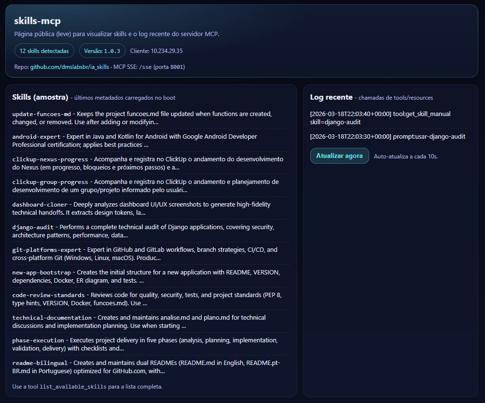
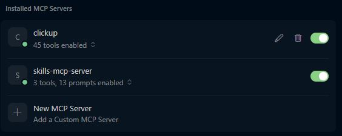
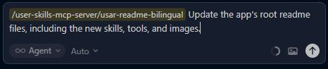

# AI Coding Skills 🚀

    

Read in Portuguese: [README.pt-BR.md](README.pt-BR.md)

A curated collection of specialized skills for modern AI coding assistants (**Antigravity**, **Cursor**). Includes expert workflows and a global MCP server that exposes all skills via tools and prompts.

## 📂 Available Skills

- **[📱 Android Expert](./android-expert)**: Java/Kotlin, Material Design 3, Firebase, Play Store best practices.
- **[✅ Code Review Standards](./code-review-standards)**: PEP 8, type hints, Docker, tests, and quality checklist.
- **[📊 ClickUp Group Progress](./clickup-group-progress)**: Track and plan any group/project in ClickUp (generic; user supplies group name).
- **[📊 ClickUp Nexus Progress](./clickup-nexus-progress)**: Track Nexus development progress and planning in ClickUp.
- **[🎨 Dashboard Cloner](./dashboard-cloner)**: UI/UX analysis from screenshots; design tokens and implementation briefs.
- **[🐍 Django Audit](./django-audit)**: Security, architecture, performance, and quality audits for Django apps.
- **[🐙 Git Platforms Expert](./git-platforms-expert)**: GitHub/GitLab workflows, CI/CD, commits, and cross-platform Git.
- **[🏗️ New App Bootstrap](./new-app-bootstrap)**: README, VERSION, Docker, ER diagram, tests, and project scaffold.
- **[📋 Phase Execution](./phase-execution)**: Five-phase delivery (analysis, planning, implementation, validation, delivery).
- **[🌍 README Bilingual](./readme-bilingual)**: Dual READMEs (EN + pt-BR) with badges and cross-links for GitHub.
- **[📝 Technical Documentation](./technical-documentation)**: Structured `analise.md` and `plano.md` for technical discussions.
- **[🔄 Update Funcoes.md](./update-funcoes-md)**: Keep `funcoes.md` in sync when functions are added, changed, or removed.

## 🛠️ MCP Server (skills-mcp)

The server exposes **tools** and **prompts** so any MCP client can use the skills without copying files.

| Type   | Examples |
|--------|----------|
| **Tools** | `list_available_skills`, `get_skill_manual`, `get_app_version` |
| **Prompts** | `usar-<skill>` (e.g. `usar-readme-bilingual`), `analisar-skills-disponiveis` |
| **Resource** | `skill://{skill_name}/instructions` (SKILL.md content) |

A lightweight **homepage** at `http://<host>:8001/` shows version, skills list, and recent activity log (auto-refresh every 10s).

## 🚀 Getting Started

### 1. Global (MCP) – Recommended

Run the MCP server so your AI assistant can call the skills from any project.

- **Windows (local)**: From repo root, run `run-server.bat` (server listens on `http://localhost:8001/sse`).
- **Linux / macOS (Docker)**: From repo root, run `./run-docker.sh` (once: `chmod +x run-docker.sh`).

**Configure your client:**

- **Antigravity**: [English](./mcp-server/antigravity_setup.md) \| [Português](./mcp-server/antigravity_setup.pt-BR.md)
- **Cursor**: [English](./mcp-server/cursor_setup.md) \| [Português](./mcp-server/cursor_setup.pt-BR.md)

### 2. Local (Copy/Paste)

- Copy a skill folder into `.agents/skills/` (Antigravity) or reference in `.cursorrules` (Cursor).

For server details and run options, see [MCP Server README](./mcp-server/README.md).

## 📷 Screenshots

| Dashboard (homepage) | MCP servers in Cursor |
|----------------------|------------------------|
|  |  |

| Using a skill prompt (e.g. readme-bilingual) |
|----------------------------------------------|
|  |

## ☕ Support

If this project helps you, consider supporting its development:

- **[Buy Me a Coffee](https://buymeacoffee.com/dmslabs)**
- **Bitcoin (BTC)**: [1MAC9RBnPYT9ua1zsgvhwfRoASTBKr4QL8](https://www.blockchain.com/btc/address/1MAC9RBnPYT9ua1zsgvhwfRoASTBKr4QL8)

## License

[MIT](LICENSE)
